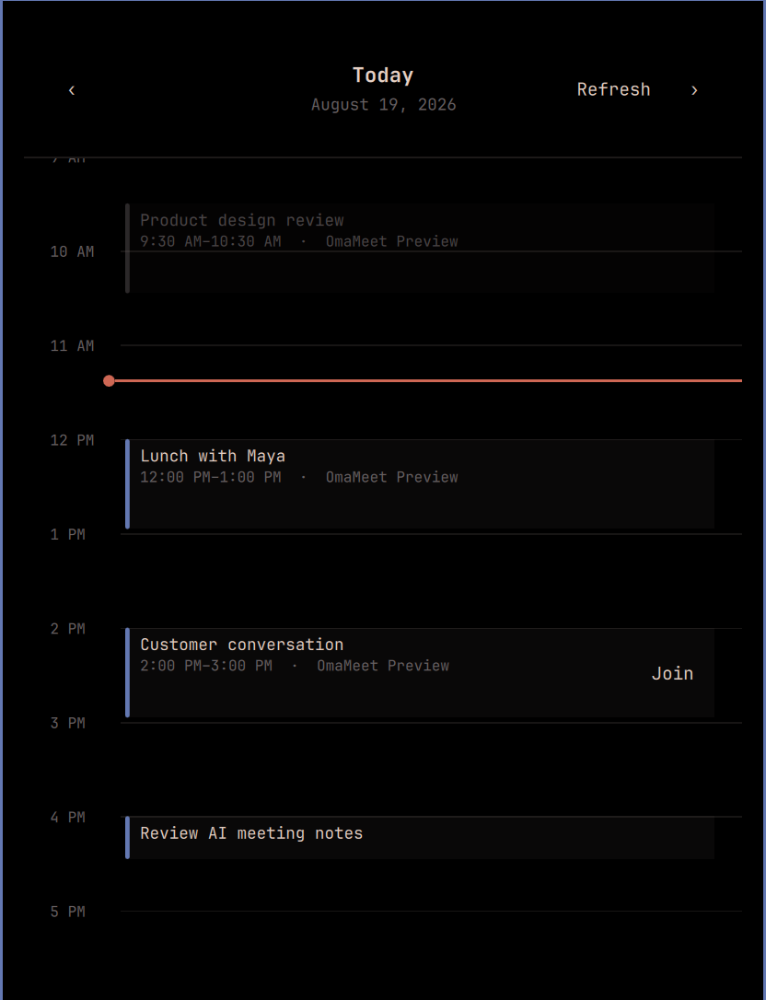

# OmaScribe — opinionated meeting notes for Omarchy

OmaScribe is a personal-first Granola replacement for Omarchy. It combines a Google
Calendar day view, one-click joining, scheduled and ad-hoc recording, local
transcription, and AI-optimized Obsidian notes.



The product assumptions are intentional:

- Google Calendar is the primary calendar. Connecting it requires your own GCP
  OAuth project.
- Audio capture and transcription run locally.
- Note optimization follows the default AI agent selected in Omarchy. OmaScribe
  does not maintain a separate provider, model, endpoint, or account picker.
- The current supported default agent is Grok. OmaScribe invokes it for one turn
  with tools denied, web search disabled, and subagents disabled.
- Notes are written into a local Obsidian-compatible vault.

## Daily use

Click the OmaScribe bar icon to view today's schedule. Use **Join** on a calendar
event to open its meeting link and start capture, or use the clearly labelled
**Record** button for an ad-hoc conversation. **Stop** ends capture and starts
local transcription and note processing.

Click the gear in the calendar panel to open OmaScribe Settings. From there you
can connect Google, select visible calendars, set calendar priority, and turn AI
optimization on or off. Hovering over the bar icon shows the next meeting, or
`No events` when the day is clear.

## Install and update

```bash
omarchy plugin add https://github.com/amitcpatel/omascribe.git --enable --yes
omarchy plugin update acp.omascribe --yes
```

Omarchy intentionally does not run plugin install hooks. The shell UI and its
bundled helpers work immediately because QML resolves them inside the plugin
directory. To also install the optional `omascribe-calendar` and
`omascribe-meetings` command links, run `./install.sh` from the cloned plugin.
The installer refuses to replace an existing regular file or command link
owned by another checkout; resolve that conflict explicitly before retrying.

## Google Calendar setup

1. Create a project in Google Cloud.
2. Enable the Google Calendar API.
3. Configure the OAuth consent screen.
4. Create an OAuth client for a desktop application and download its client
   secret JSON.
5. Place it at `~/.config/omascribe-calendar/client_secret.json` with mode `0600`.
6. Click **Add Google** in OmaScribe Settings and complete browser authorization.

The calendar integration requests read-only Calendar access.

## AI optimization

AI optimization is disabled until the user explicitly enables it in OmaScribe
Settings. Enabling persists OmaScribe-specific consent to send transcript text to
the cloud service used by Omarchy's selected agent. The agent is resolved at
processing time, so changing Omarchy's default changes what OmaScribe uses.

```bash
omarchy-default-agent
omascribe-meetings ai status --json
omascribe-meetings ai disable
omascribe-meetings ai enable
```

Until that consent is given—and whenever AI is off or unavailable—local transcription still succeeds
and OmaScribe writes deterministic basic notes. Transcript text is sent to the
selected AI service only when optimization is enabled. Transcript content is
treated as untrusted input in every extraction and note-writing pass.

## Files and recovery

The default vault is `~/Projects/Knowledge/Meetings`. Each meeting receives its
own folder containing the transcript, structured extraction record, meeting
metadata, and rendered notes. Audio is deleted only after the complete pipeline
succeeds unless `retainAudio` is enabled; failed processing retains it for recovery.

Configuration lives at `~/.config/omascribe/config.json` and runtime state
at `~/.local/state/omascribe/`.

Useful diagnostics:

```bash
omascribe-meetings status --json
omascribe-meetings doctor
omascribe-meetings config
```

If the optional CLI links were not installed, run the helper from the plugin:

```bash
~/.config/omarchy/plugins/acp.omascribe/bin/omascribe-meetings doctor
```

## Documentation

- [Architecture and processing lifecycle](docs/ARCHITECTURE.md)
- [Configuration and command reference](docs/CONFIGURATION.md)
- [Privacy and security boundaries](docs/PRIVACY.md)
- [Troubleshooting and recovery](docs/TROUBLESHOOTING.md)
- [Release history](CHANGELOG.md)
- [0.5.1 release gate](RELEASE_STATUS.md)
- [Independent review record](REVIEW_FINDINGS.md)

## Development status

Version 0.5.1 carries the reviewed safeguards under the distinct OmaScribe
identity. It restores ad-hoc recording,
follows Omarchy's default AI agent, and makes Google Calendar the opinionated
primary calendar experience. Remote calendar connections are pinned to validated
public addresses, and every Whisper model is accepted only after SHA-256
verification against the immutable artifact allowlist.
